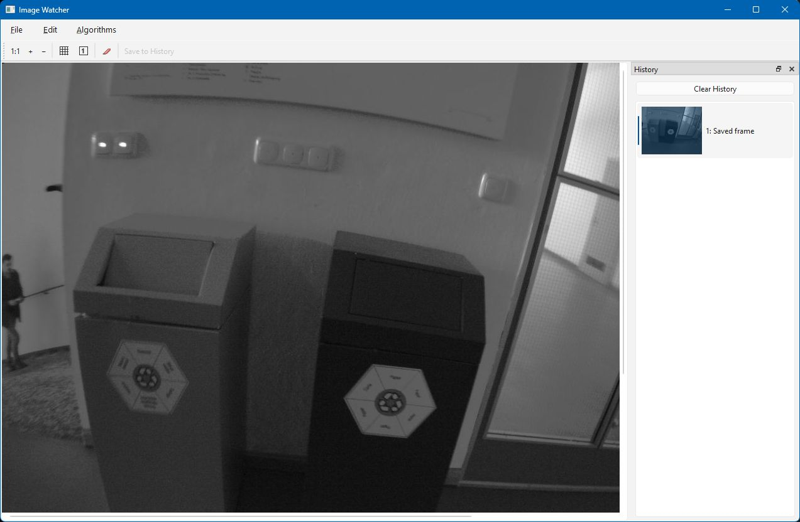
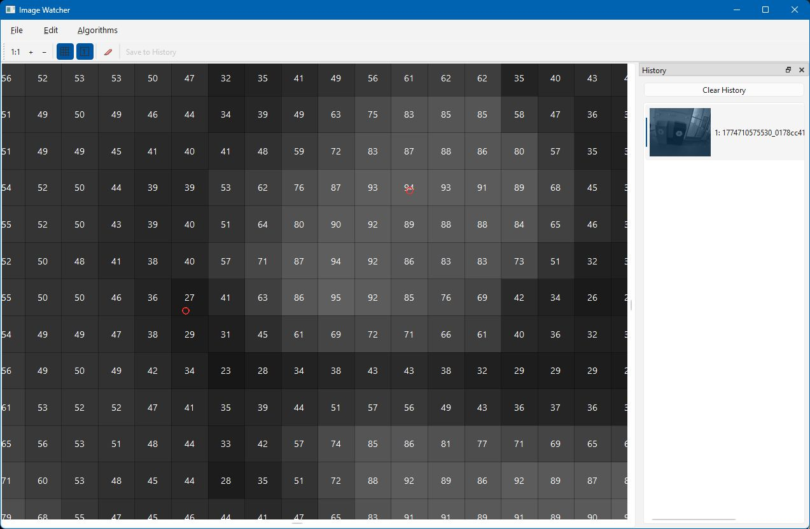

# watcher

A lightweight image viewer designed for computer vision development. It accepts images from files, the clipboard, or a live TCP stream — making it easy to visualize frames from a running CV pipeline without stopping the process.

---



---

## Features

- **Live image streaming** — receive raw frames from any C++, Python, or other process over a local TCP socket (port 14972)
- **File & clipboard** — open images from disk or paste directly from the clipboard
- **Zoom & pan** — smooth zoom with `Ctrl+Scroll`; click-and-drag to pan at high zoom levels
- **Pixel grid overlay** — draws grid lines between pixels when zoom > 4×
- **Per-pixel intensity values** — renders the grayscale intensity of each pixel inside its cell when zoom > 20×
- **History panel** — a persistent thumbnail dock that survives across sessions (stored in `~/.watcher/`)
- **Feature detection** — run FAST, GFTT, SIFT, ORB, BRISK, or AKAZE directly on the displayed image
- **Sub-pixel peak detection** — right-click any pixel to fit a parabola and locate the brightness peak with sub-pixel accuracy
- **Annotations** — programmatic overlay of lines, rectangles, and ellipses in image-space coordinates
- **Grayscale conversion** — one-click conversion of any colour image to grayscale

---

## Installation

### Prerequisites

- Python 3.10+
- pip

### Install Python dependencies

```bash
pip install -r requirements.txt
```

`requirements.txt` installs:

| Package | Purpose |
|---|---|
| `PyQt6` | GUI framework |
| `numpy` | Array operations for image conversion |
| `opencv-python` | Feature detection and image I/O in the C++ sender |

### Run

```bash
python watcher.py                          # open with no image
python watcher.py image.png                # open one image
python watcher.py frame1.jpg frame2.png   # open multiple images
```

> **Windows note:** running `watcher.py image.png` directly (without `python`) uses the `.py` file association, which typically does not forward arguments. Always invoke via `python watcher.py ...`.

---

## Usage

### Opening images

| Method | How |
|---|---|
| File | **File → Open…** or `Ctrl+O` |
| Clipboard | **Edit → Paste** or `Ctrl+V` |
| Network | Send a frame over TCP to `127.0.0.1:14972` (see [Network protocol](#network-protocol)) |

### Zoom and navigation

| Action | Gesture |
|---|---|
| Zoom in / out | `Ctrl + Scroll wheel` |
| Reset to 1:1 | Toolbar **1:1** button |
| Zoom in / out (toolbar) | **+** / **−** buttons |
| Pan (when zoomed) | Left-click drag |



### Pixel grid and value overlays

Toggle from the toolbar:

- **Grid icon** — draws faint lines between pixels (visible when zoom > 4×)
- **Values icon** — renders the averaged intensity value inside each pixel cell (visible when zoom > 20×)

### Sub-pixel peak detection

Right-click any pixel while zoomed in (> 4×) and at least one pixel away from the edge:

- **Sub-pixel peak** — fits independent parabolas along the x and y axes through the 3×3 neighbourhood and places a red circle marker at the estimated sub-pixel peak location
- **Clear peaks** — removes all markers


### History panel

The **History** dock (right side) shows a thumbnail list of every image you have viewed or saved.

- Images received over the network are displayed immediately but **not** saved to history automatically — use the **Save to History** toolbar button to snapshot a frame you want to keep
- Images opened from a file or pasted from the clipboard are added to history automatically
- History is persisted to `~/.watcher/` as PNG files and reloaded on the next launch
- Right-click any thumbnail and choose **Remove** to delete it from history and disk
- **Clear History** button deletes all history entries and files

### Screenshot needed: history panel
> **[SCREENSHOT]** The History dock showing several thumbnail entries with labels, including at least one "Network frame" entry.

### Feature detection

**Algorithms → Feature detection…** opens a dialog to run a keypoint detector on the current image.

Supported detectors:

| Method | Parameters exposed |
|---|---|
| FAST | Threshold, non-max suppression |
| GFTT | Max corners, quality level, min distance, Harris mode |
| SIFT | Max features, contrast threshold, edge threshold |
| ORB | Max features, scale factor, pyramid levels |
| BRISK | Threshold, octaves |
| AKAZE | Threshold, octaves, octave layers |

Detected keypoints are displayed as red circle markers on the image. Use the **Clear peaks** toolbar button (eraser icon) to remove them.

### Screenshot needed: feature detection dialog
> **[SCREENSHOT]** The Feature Detection dialog open with the method dropdown showing "SIFT" selected and its parameters filled in. The main window behind it should show detected keypoints as red circles.

### Algorithms menu

| Action | Effect |
|---|---|
| **Feature detection…** | Opens the feature detection dialog (see above) |
| **Convert to Grayscale** | Converts the current image to 8-bit grayscale and adds it to history |

### Clipboard

- **Edit → Copy** (`Ctrl+C`) — copies the current image to the system clipboard
- **Edit → Paste** (`Ctrl+V`) — pastes an image from the system clipboard and adds it to history

---

## Network protocol

Watcher listens on `0.0.0.0:14972` (TCP) as soon as it starts. Any process on the same machine can push raw image frames to it.

### Wire format

Each image consists of a fixed 16-byte header followed immediately by raw pixel data:

```
Offset  Size  Type    Description
──────  ────  ──────  ──────────────────────────────────────────
     0     4  bytes   Magic: 'W', 'I', 'M', 'G'
     4     4  uint32  Width in pixels  (little-endian)
     8     4  uint32  Height in pixels (little-endian)
    12     4  uint32  Channels: 1 = grayscale, 3 = BGR, 4 = BGRA
```

**Payload:** `width × height × channels` bytes of raw `uint8` pixel data, row-major, top-left first, in BGR(A) byte order (matching OpenCV's default).

Multiple frames may be sent over a single connection sequentially. The server reads them until the connection is closed.

### Sending from Python

```python
import socket, struct, numpy as np

def send_image(arr: np.ndarray, host="127.0.0.1", port=14972):
    """arr must be uint8, shape (H, W) or (H, W, 3) or (H, W, 4), BGR(A) byte order."""
    if arr.ndim == 2:
        h, w, ch = arr.shape[0], arr.shape[1], 1
        arr = arr.reshape(h, w, 1)
    else:
        h, w, ch = arr.shape
    header = struct.pack("<4sIII", b"WIMG", w, h, ch)
    with socket.create_connection((host, port)) as s:
        s.sendall(header + np.ascontiguousarray(arr).tobytes())
```

### Sending from C++ (img_send_test)

The repository includes a test sender written in C++ that uses OpenCV to load an image and transmit it using the same protocol.

#### Build

Requires CMake 3.16+, a C++17 compiler, and OpenCV. [vcpkg](https://vcpkg.io/) is supported automatically if `VCPKG_ROOT` is set.

```bash
cmake -B build -S .
cmake --build build
```

On Windows with vcpkg:

```powershell
$env:VCPKG_ROOT = "C:\vcpkg"
cmake -B build -S .
cmake --build build
```

#### Run

```bash
# Linux / macOS
./build/img_send_test path/to/image.png

# Windows
.\build\Debug\img_send_test.exe path\to\image.png
```

The tool loads the image with `cv::imread`, packs the header, and sends the raw pixel bytes. It prints the resolution and byte count on success:

```
Sent 640x480x3 (921600 bytes) to 127.0.0.1:14972
```

> **Note:** Watcher must already be running before you connect. If the connection is refused, start `watcher.py` first.

---

## Programmatic use (Python)

`ImageWidget` and `MainWindow` can be embedded in other PyQt6 applications.

### Display any image in an `ImageWidget`

```python
import numpy as np
from watcher import ImageWidget

widget = ImageWidget()

# From a NumPy array (grayscale, BGR, or BGRA, uint8)
widget.set_image(np.zeros((480, 640, 3), dtype=np.uint8))

# From a file path
widget.set_image("/path/to/image.png")

# From a QPixmap or QImage
widget.set_image(some_qpixmap)
```

### Annotations

Annotations are drawn on top of the image in original-image pixel coordinates:

```python
widget.set_annotations([
    {"kind": "rect",    "rect": [10, 20, 100, 50], "color": "blue",  "width": 2},
    {"kind": "line",    "points": [0, 0, 200, 100], "color": "green", "width": 1},
    {"kind": "ellipse", "rect": [50, 50, 80, 40],   "color": "red",   "width": 2},
])
```

### Peak markers

```python
widget.set_peak_markers([(123.4, 56.7), (200.1, 300.9)])
widget.clear_peak_markers()
```

---

## File layout

```
watcher/
├── watcher.py          # PyQt6 application (viewer + TCP server)
├── img_send_test.cpp   # C++ image sender (test / integration)
├── CMakeLists.txt      # Build script for img_send_test
└── requirements.txt    # Python dependencies
```

---

## License

See [LICENSE](LICENSE).
